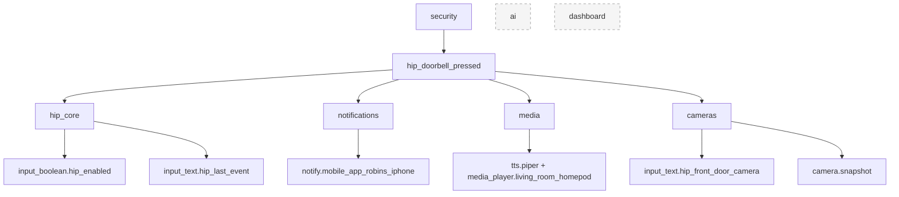
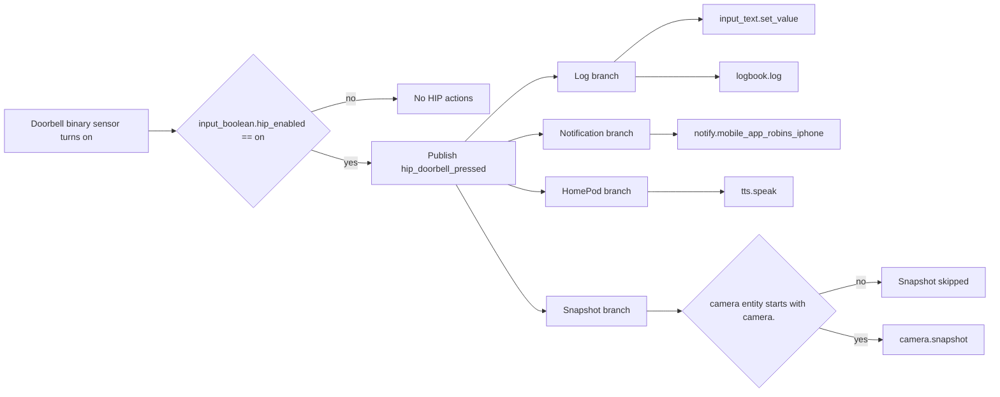
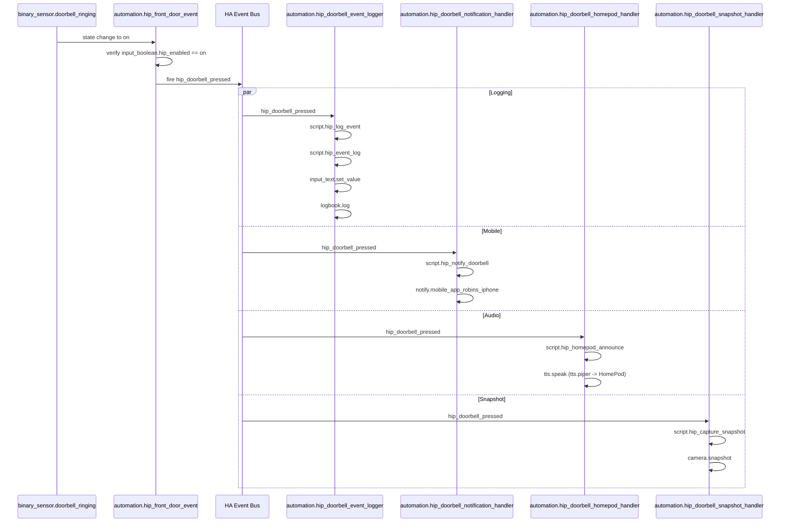

# HIP v2.0.0 Pull Request Review Package

Baseline: commit 91e1bca
Scope: documentation-only review of the production package implementation currently in main.

## Production Maintenance Constraints

- Reliability is preferred over feature expansion.
- Working code should be extended rather than rewritten.
- Package scope should stay narrow: one responsibility per package.
- Each trigger should publish one normalized event.
- Duplicate automations and duplicate entity IDs should be treated as production defects.
- Race-condition analysis is required for any event fan-out design.
- Every implementation must define a migration path.
- Every change must define rollback instructions.

## 1) Complete Architectural Overview Of Every Package

### Package: hip_core
Purpose:
- Provides global platform control and canonical event logging.

Defined assets:
- input_boolean.hip_enabled
- input_text.hip_last_event
- script.hip_event_log
- script.hip_log_event
- automation.hip_doorbell_event_logger

Inbound dependencies:
- Consumes event: hip_doorbell_pressed

Outbound dependencies:
- Calls input_text.set_value
- Calls logbook.log
- Calls script.hip_event_log (from script.hip_log_event)

Role in platform:
- Central state and logging boundary for HIP runtime events.

### Package: security
Purpose:
- Detects doorbell ring and publishes normalized HIP event.

Defined assets:
- automation.hip_front_door_event

Inbound dependencies:
- Reads binary_sensor.doorbell_ringing
- Reads input_boolean.hip_enabled

Outbound dependencies:
- Fires custom event: hip_doorbell_pressed

Role in platform:
- Event producer for the doorbell domain.

### Package: notifications
Purpose:
- Sends rich iPhone notification when doorbell event occurs.

Defined assets:
- script.hip_notify_doorbell
- automation.hip_doorbell_notification_handler

Inbound dependencies:
- Consumes event: hip_doorbell_pressed
- Reads input_boolean.hip_enabled

Outbound dependencies:
- Calls notify.mobile_app_robins_iphone
- References image path /local/snapshots/front_door_latest.jpg

Role in platform:
- User-facing mobile alert boundary.

### Package: media
Purpose:
- Announces doorbell events over HomePod using Piper TTS.

Defined assets:
- script.hip_homepod_announce
- automation.hip_doorbell_homepod_handler

Inbound dependencies:
- Consumes event: hip_doorbell_pressed
- Reads input_boolean.hip_enabled

Outbound dependencies:
- Calls tts.speak
- Targets tts.piper
- Targets media_player.living_room_homepod

Role in platform:
- In-home audio response boundary.

### Package: cameras
Purpose:
- Captures and stores doorbell snapshots.

Defined assets:
- input_text.hip_front_door_camera
- script.hip_capture_snapshot
- automation.hip_doorbell_snapshot_handler

Inbound dependencies:
- Consumes event: hip_doorbell_pressed
- Reads input_boolean.hip_enabled
- Reads input_text.hip_front_door_camera

Outbound dependencies:
- Calls camera.snapshot
- Writes /config/www/snapshots/front_door_latest.jpg (default)

Role in platform:
- Visual evidence capture boundary.

### Package: ai
Purpose:
- Reserved package boundary for future AI integrations.

Defined assets:
- No YAML-defined entities, scripts, or automations in current implementation.

Role in platform:
- Placeholder package namespace for future Frigate, CompreFace, Whisper, and Ollama features.

### Package: dashboard
Purpose:
- Reserved package boundary for dashboard-specific package assets.

Defined assets:
- No files in current implementation.

Role in platform:
- Structural namespace only in current implementation.

## 2) Mermaid Diagrams

### Event Flow
```mermaid
flowchart LR
    A[binary_sensor.doorbell_ringing = on] --> B[automation.hip_front_door_event]
    B --> C{{event: hip_doorbell_pressed}}

    C --> D[automation.hip_doorbell_event_logger]
    D --> E[script.hip_log_event]
    E --> F[script.hip_event_log]
    F --> G[input_text.hip_last_event]
    F --> H[logbook.log]

    C --> I[automation.hip_doorbell_notification_handler]
    I --> J[script.hip_notify_doorbell]
    J --> K[notify.mobile_app_robins_iphone]

    C --> L[automation.hip_doorbell_homepod_handler]
    L --> M[script.hip_homepod_announce]
    M --> N[tts.speak via tts.piper to media_player.living_room_homepod]

    C --> O[automation.hip_doorbell_snapshot_handler]
    O --> P[script.hip_capture_snapshot]
    P --> Q[camera.snapshot]
    Q --> R[/config/www/snapshots/front_door_latest.jpg]
```

### Package Dependencies


### Doorbell Pipeline


## 3) List Of Every Entity Created

The following are the entities explicitly defined by package YAML in current implementation:

Helpers:
- input_boolean.hip_enabled
- input_text.hip_last_event
- input_text.hip_front_door_camera

Scripts:
- script.hip_event_log
- script.hip_log_event
- script.hip_notify_doorbell
- script.hip_homepod_announce
- script.hip_capture_snapshot

Automations (unique IDs declared):
- hip_front_door_event
- hip_doorbell_event_logger
- hip_doorbell_notification_handler
- hip_doorbell_homepod_handler
- hip_doorbell_snapshot_handler

Referenced external entities and devices (not created by HIP packages):
- binary_sensor.doorbell_ringing
- tts.piper
- media_player.living_room_homepod
- camera.front_door

## 4) List Of Every Service Called

Service/action calls found in package YAML:
- input_text.set_value
- logbook.log
- script.hip_event_log
- script.hip_log_event
- script.hip_notify_doorbell
- script.hip_homepod_announce
- script.hip_capture_snapshot
- notify.mobile_app_robins_iphone
- tts.speak
- camera.snapshot

Non-service event publication used:
- event hip_doorbell_pressed

## 5) Sequence Diagram Of The Doorbell Event



## 6) Dependency Graph

```mermaid
graph TD
    subgraph Inputs
        DB[binary_sensor.doorbell_ringing]
        EN[input_boolean.hip_enabled]
        FC[input_text.hip_front_door_camera]
    end

    subgraph Security
        S1[automation.hip_front_door_event]
    end

    subgraph EventBus
        EV[hip_doorbell_pressed]
    end

    subgraph Core
        C1[automation.hip_doorbell_event_logger]
        C2[script.hip_log_event]
        C3[script.hip_event_log]
        LAST[input_text.hip_last_event]
    end

    subgraph Notifications
        N1[automation.hip_doorbell_notification_handler]
        N2[script.hip_notify_doorbell]
        NS[notify.mobile_app_robins_iphone]
    end

    subgraph Media
        M1[automation.hip_doorbell_homepod_handler]
        M2[script.hip_homepod_announce]
        TS[tts.speak]
        TP[tts.piper]
        MP[media_player.living_room_homepod]
    end

    subgraph Cameras
        A1[automation.hip_doorbell_snapshot_handler]
        A2[script.hip_capture_snapshot]
        CS[camera.snapshot]
        FILE[/config/www/snapshots/front_door_latest.jpg]
    end

    DB --> S1
    EN --> S1
    S1 --> EV

    EV --> C1
    EN --> C1
    C1 --> C2 --> C3
    C3 --> LAST

    EV --> N1
    EN --> N1
    N1 --> N2 --> NS

    EV --> M1
    EN --> M1
    M1 --> M2 --> TS
    TS --> TP
    TS --> MP

    EV --> A1
    EN --> A1
    A1 --> A2 --> CS
    FC --> A2
    CS --> FILE
```

## 7) Known Limitations

- Single-event type currently models only doorbell pressed; no standardized event taxonomy yet for motion, person, delivery, or tamper events.
- Notification payload uses a fixed image path and does not verify freshness before send.
- Snapshot script validates only camera entity string format, not camera availability/state.
- No explicit retry or dead-letter pattern for failed service calls.
- AI and dashboard package namespaces exist but are not implemented.
- Logging model stores only the last event in input_text.hip_last_event, so there is no built-in historical structured event store.

## 8) Potential Race Conditions

- Notification may be delivered before snapshot file update, causing stale image attachment if the previous snapshot is reused.
- Concurrent rapid doorbell presses may queue script executions while automations are mode single; some event handling overlap can still produce out-of-order user perception (audio vs notification timing).
- Multiple consumers subscribed to hip_doorbell_pressed execute independently; completion order is not guaranteed.
- If input_text.hip_front_door_camera is changed during active event handling, concurrent runs may capture from unexpected camera entity.

## 9) Home Assistant Best Practice Recommendations

- Use an explicit package contract document per package:
  - Inputs, outputs, services called, required external entities.
- Keep event names domain-scoped and versionable, for example hip.security.doorbell_pressed.v1.
- Add availability guards for critical dependencies:
  - camera availability, notify target presence, media player availability.
- Add traceable correlation IDs in event_data for multi-branch observability.
- Add automation trace validation to regression checklist after each release.
- Keep scripts mode queued for user-facing actions and document queue expectations.
- Add health-check automations for required entities and notify on configuration drift.
- Maintain package-level tests in the checklist tied to acceptance criteria.

## 10) Suggested Improvements For HIP v2.1

- Define a normalized HIP event schema:
  - event_type, source, timestamp, correlation_id, confidence, media_refs.
- Implement two-phase pipeline for snapshot-aware notifications:
  - capture first, then notify with confirmed fresh image path.
- Add persistent event storage strategy:
  - recorder-backed tags, dedicated logbook taxonomy, or external event sink.
- Add anti-spam and debounce strategy for repeated ring events within a short window.
- Add failure-handling policy:
  - retry counts, fallback notification path, and failure metrics.
- Prepare AI package integration points:
  - Frigate event ingestion adapter, CompreFace enrichment hooks, Whisper transcription hooks, Ollama reasoning hooks.
- Add dashboard package implementation for operator observability:
  - pipeline status cards, recent event timeline, failed action counters.
- Add package-level contract tests and release gate checklist for v2.1 PRs.

## 11) Migration Path For v2.0.0

1. Back up the full Home Assistant configuration and current HIP packages.
2. Deploy v2.0.0 package files without renaming existing helpers, scripts, or automations.
3. Verify /config/www/snapshots exists before restart.
4. Restart Home Assistant and confirm all five doorbell automations are loaded.
5. Trigger one controlled doorbell event and validate logging, notification, audio, and snapshot behavior.

## 12) Rollback Instructions For v2.0.0

1. Stop rollout on first validation failure.
2. Restore the prior HIP package files from backup or the previous release checkout.
3. Restart Home Assistant.
4. Re-run the previous release validation path before returning the system to service.

## Appendix: Source Files Reviewed

- homeassistant/packages/security/doorbell.yaml
- homeassistant/packages/hip_core/helpers.yaml
- homeassistant/packages/hip_core/scripts.yaml
- homeassistant/packages/hip_core/configuration.yaml
- homeassistant/packages/notifications/scripts.yaml
- homeassistant/packages/media/scripts.yaml
- homeassistant/packages/cameras/cameras.yaml
- homeassistant/packages/cameras/snapshot.yaml
- homeassistant/packages/ai/README.md
- homeassistant/packages/security/README.md
- homeassistant/packages/hip_core/README.md
- homeassistant/packages/notifications/README.md
- homeassistant/packages/media/README.md
- homeassistant/packages/cameras/README.md
